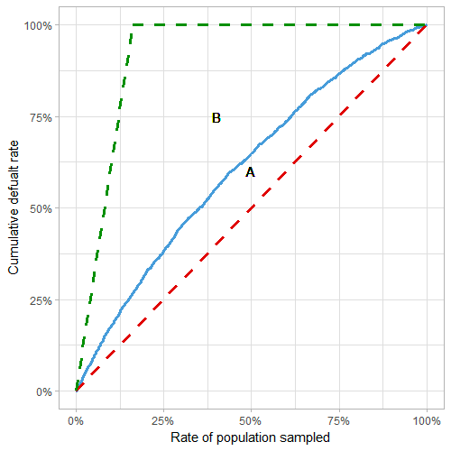
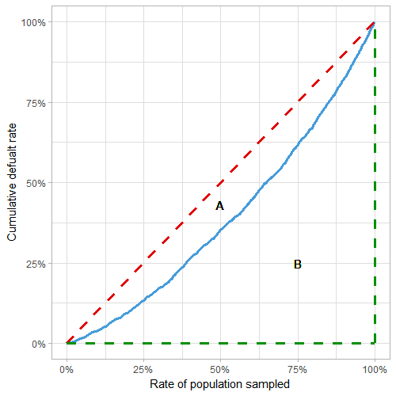
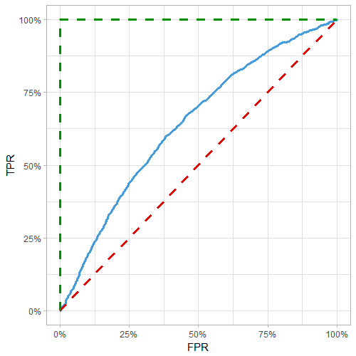
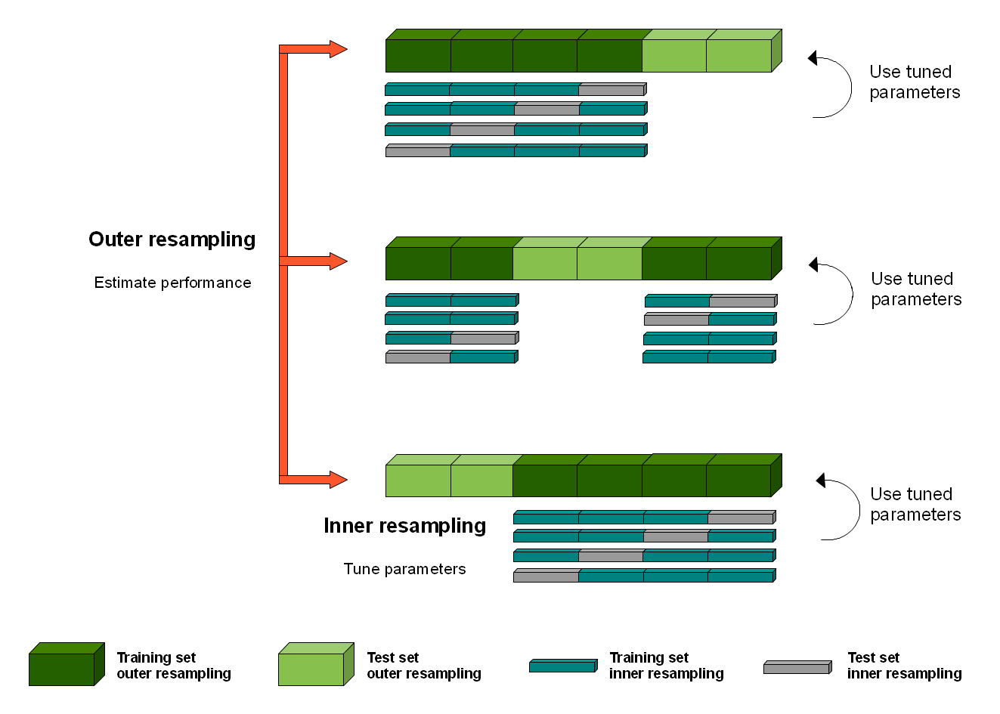

```{r setup, include=FALSE}
knitr::opts_chunk$set(echo = TRUE)
```

# R-squared

$$R^2 = \frac{\sum(y_i - \bar{y})^2 - \sum(y_i - \hat{y_i})^2}{\sum(y_i - \bar{y})^2}$$ Perfect model: $\hat{y_i} = y_i$ so $R^2 = 1$

# Gini

Ratio of how close model is to perfect model and how far it is from a random model. Gini = 1 → perfect model, Gini = 0 → random model

[This article](https://towardsdatascience.com/using-the-gini-coefficient-to-evaluate-the-performance-of-credit-score-models-59fe13ef420) derives Gini using three methods: from the CAP curve, from the Lorenz curve, and from the ROC curve.

-   In all cases, order data by prediction, plot cumulative response vs cumulative proportion of sample

-   Red line: random model, blue line: actual model, green line: perfect model

    -   Gini = A/(A+B) = 2\*AUC - 1

From CAP curve:

{width="406"}

From Lorenz curve:

{width="428"}

From ROC curve:

{width="409"}

# Lift Chart

## Single Lift

-   Order data by prediction/weight, group into bins (e.g. deciles) with equal weight (e.g. earned car years)

-   Within each bin, get average predicted and actual value

## Double Lift

For comparing 2 predictions to actual

-   Order data by prediction_1/prediction_2, group into bins

-   Within each bin, get averaged prediction_1, prediction_2, and actual value

# Binomial Deviance

[Deviance](https://data.princeton.edu/wws509/notes/a2s4) = $2 \sum o_i log \left( \frac{o_i}{e_i} \right)$ where $o_i$ denotes observed, $e_i$ denotes expected, and the sum is over both successes and failures for each i

-   Gives measure of deviance of fitted glm with respect to perfect model (aka saturated model, a model that perfectly fits the data)

-   [Alternate definitions](https://bookdown.org/egarpor/PM-UC3M/glm-deviance.html): Deviance = $-2 \left[ l(\hat{\beta}) - l_s \right]$ where the log-likelihood of the fitted model $l(\hat{\beta})$ is always smaller than the saturated model

    -   For a linear model, Deviance = $RSS(\hat{\beta})$ = SSE

    -   Deviance is always greater than or equal to 0, if 0 then the fit is perfect

-   Generally compared to null deviance $D_0 = -2 \left[ l(\hat{\beta}_0) - l_s \right]$ which compares a model without predictors (intercept only) to the perfect model

    -   For a linear model, $D_0$ = SST

-   To quantify the percent of deviance explained (ratio indicating how close the fit is to being perfect) use $R^2 = 1- \frac{D}{D_0}$

    -   For a linear model, $R^2 = 1-\frac{SSE}{SST}$

    -   Also known as [McFadden's R^2^](https://thestatsgeek.com/2014/02/08/r-squared-in-logistic-regression/)= $1 - \frac{log(L_{full})}{log(L_{intercept})}$ where L~full~ is the likelihood value from the fitted model.

        -   The likelihood contribution of each observation is between 0 and 1, so the log likelihood is always negative

        -   If the model has no predictive ability → likelihood of model similar to likelihood of intercept → R^2^ close to 0

        -   If model explains almost everything → likelihood value for each observation close to 1 → log(1) = 0 → R^2^ close to 1

-   In R, deviance is returned in `summary` as "Residual deviance" and "Null deviance"

-   To calculate log likelihood of fitted model: $\sum \left( log(\hat{y}_i)*y_i + log(1-\hat{y}_i)*(1-y_i) \right)$ where $\hat{y_i}$ is the fitted probability and $y_i$ is the actual response value

    -   For the null model: use $\hat{y} = mean(y)$ using the y values from the training data

# Metrics from Confusion Matrix


-   Precision = positive predictive value = TP / (TP + FP)

-   Sensitivity = recall = true positive rate = TP / (TP + FN)

-   Specificity = true negative rate = TN / (TN + FP)

-   F1 score = $2 \frac{Precision * Recall}{Precision + Recall}$

-   Matthew's correlation coefficient = MCC = $\frac{TP * TN - FP * FN}{\sqrt{(TP+FP)(TP+FN)(TN+FP)(TN+FN)}}$

    -   Between -1 and 1: 1 → perfect prediction, 0 → no better than random, -1 → total disagreement between prediction and observation

# Confidence Intervals for Machine Learning

See [here](https://machinelearningmastery.com/confidence-intervals-for-machine-learning/) for more details

-   For classification accuracy: assume Gaussian distribution of the proportion, use Binomial proportion confidence interval

    -   intervals = z\*sqrt( (accuracy \* (1-accuracy)) / n)

**Nonparametric Confidence Interval**

-   Use bootstrap resampling:

    -   Sample with replacement to get dataset of size n

    -   Calculate statistic on sample

    -   Repeat (maybe 100 times)

    -   Calculate central tendency (median) of 100 sample statistics, and 2.5th and 97.5th percentile

# Nested Cross Validation

[Motivation/Theory](https://machinelearningmastery.com/nested-cross-validation-for-machine-learning-with-python/), [Method/Figure](https://weina.me/nested-cross-validation/)

K-fold cross-validation is used both in the selection of model hyperparameters to configure each model and in the selection of configured model and can lead to overfitting. Each time a model with different model hyperparameters is evaluated on a dataset, it provides information about the dataset.

**Method**



-   Split into K fold (outer folds)

-   Within each K fold:

    -   Split the outer training set (dark green) into L folds (blue/gray)

    -   For each L fold:

        -   Train each hyperparameter on inner training (blue), test on inner test (gray)

        -   For each hyperparameter: average metrics across L folds, choose best

    -   Train on outer training (dark green) with best hyperparameter

    -   Test on outer test (light green)

-   Calculate mean metrics over all K folds

Cost of validation

-   Cross-validation = n\*k = hyperparameters \* models

-   Nested cross-validation = L\*n\*k = inner models \* hyperparameters \* outer models
